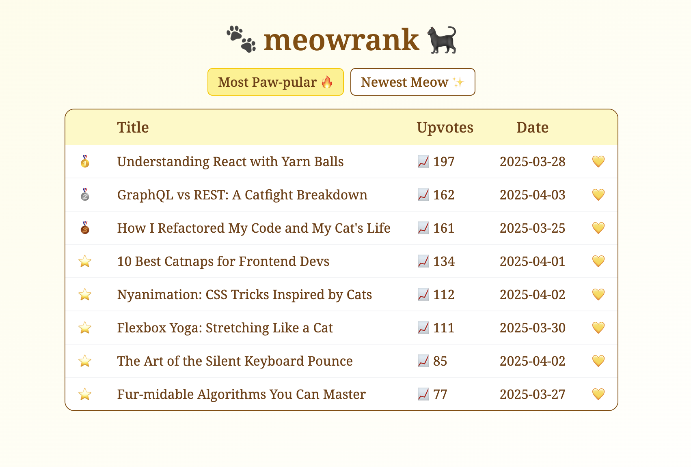

# 🐾 meowrank

A little cat-themed ranking board for cat 🐈‍⬛ articles - with paws 🐾, medals 🏅 and memory ⭐️.

<p align="center"><i>A preview of the ranking board: </i></p>



---

## 🖥️ Demo

[meowrank app](https://meowrank.netlify.app/)

## 🛠️ Tech Stack

- React@19 + Vite
- Tailwind CSS
- localStorage
- Deployed w/ Netlify

## 🚀 Getting Started

```bash
$ git clone https://github.com/yjie10/meowrank
$ cd meowrank
$ npm install
$ npm run dev
```

Open http://localhost:5173 to view it in the browser.

## ⚙️ Features

- **Upvote** any article 💛
- **Sort** by popularity ("Most Paw-pular") 🥇🥈🥉⭐️
- **Sort** by date 🗓️
- Auto saves votes via **localStorage** 💾

Everything is fluffily remembered. 🐱

## 💬 About

🐾 meowrank 🐾 is a mini React project built to refresh my React skills, explore localStorage and have some fun with cat-themed UI.
Features include **upvote**, **sorting** and data saving via **localStorage** (as mentioned in Features). It's a simple app, but hope you feel the cat 🐈‍⬛ vibes it's trying to express (😂).

<!-- 🐾 meow! meow meow meow! meow ~ meow meow! ✨ 🐈‍⬛ -->
